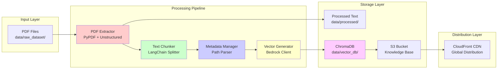
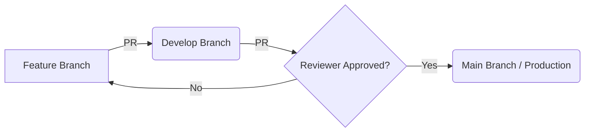

# Design Document - Phase 2: Backend Infrastructure & Knowledge Engineering

## Overview

Phase 2 implements the ETL (Extract, Transform, Load) pipeline that transforms raw PDF educational materials into a searchable vector database. The system processes 15 PDF files from BSE Kemdikbud, extracts clean text, chunks it into semantic units, generates embeddings using AWS Bedrock, and stores everything in ChromaDB for local semantic search.

The design follows a modular pipeline architecture where each component has a single responsibility and can be tested independently. The pipeline is designed to be cost-efficient (staying within $1.00/month budget), fault-tolerant (continues processing even if individual files fail), and reproducible (can be re-run to regenerate the knowledge base).

### Key Design Goals
1. **Cost Efficiency**: Minimize AWS API calls through batching and caching
2. **Fault Tolerance**: Handle errors gracefully without stopping the entire pipeline
3. **Reproducibility**: Pipeline can be re-run to regenerate knowledge base
4. **Quality**: Validate data at each stage to ensure accuracy
5. **Performance**: Process 15 PDFs (140MB) in under 30 minutes

## Architecture

### System Components





### Data Flow

1. **Extraction Phase**: PDF → Clean Text
   - Input: PDF files from `data/raw_dataset/kelas_10/informatika/`
   - Process: Extract text, remove headers/footers, preserve structure
   - Output: Clean text files in `data/processed/text/`

2. **Chunking Phase**: Clean Text → Text Chunks
   - Input: Clean text files
   - Process: Split into 500-1000 char chunks with 100 char overlap
   - Output: List of text chunks with position metadata

3. **Metadata Phase**: Text Chunks → Enriched Chunks
   - Input: Text chunks
   - Process: Add subject, grade, source, chunk_id
   - Output: JSON objects with text + metadata

4. **Embedding Phase**: Enriched Chunks → Vector Embeddings
   - Input: Enriched chunks
   - Process: Generate 1024-dim vectors via Bedrock API
   - Output: Vectors + metadata pairs

5. **Storage Phase**: Vectors → ChromaDB
   - Input: Vectors + metadata
   - Process: Store in ChromaDB collection
   - Output: Persistent vector database

6. **Distribution Phase**: ChromaDB → S3 → CloudFront
   - Input: ChromaDB database files
   - Process: Compress, upload to S3, invalidate CloudFront cache
   - Output: Downloadable knowledge base package

## Components and Interfaces

### 1. PDF Extractor (`src/data_processing/pdf_extractor.py`)

**Purpose**: Extract clean text from PDF files while removing formatting artifacts.

**Interface**:
```python
class PDFExtractor:
    def extract_text(self, pdf_path: str) -> str:
        """Extract clean text from a PDF file.
        
        Args:
            pdf_path: Path to PDF file
            
        Returns:
            Clean text content with headers/footers removed
            
        Raises:
            PDFExtractionError: If extraction fails
        """
        
    def extract_batch(self, pdf_paths: List[str]) -> Dict[str, str]:
        """Extract text from multiple PDFs.
        
        Args:
            pdf_paths: List of PDF file paths
            
        Returns:
            Dictionary mapping pdf_path -> extracted_text
        """
```

**Implementation Strategy**:
- Use `pypdf` for basic text extraction
- Use `unstructured` library for advanced cleaning (removes headers/footers)
- Implement heuristics to detect and remove page numbers
- Preserve paragraph structure using double newlines
- Handle extraction errors gracefully (log and continue)

**Dependencies**: `pypdf`, `unstructured`

### 2. Text Chunker (`src/data_processing/text_chunker.py`)

**Purpose**: Split text into optimal chunks for embedding generation.

**Interface**:
```python
class TextChunker:
    def __init__(self, chunk_size: int = 800, overlap: int = 100):
        """Initialize chunker with size parameters.
        
        Args:
            chunk_size: Target chunk size in characters (500-1000)
            overlap: Overlap between chunks in characters
        """
        
    def chunk_text(self, text: str) -> List[TextChunk]:
        """Split text into overlapping chunks.
        
        Args:
            text: Input text to chunk
            
        Returns:
            List of TextChunk objects with text and position
        """
```

**Data Model**:
```python
@dataclass
class TextChunk:
    text: str
    start_pos: int
    end_pos: int
    chunk_index: int
```

**Implementation Strategy**:
- Use LangChain's `RecursiveCharacterTextSplitter`
- Split at sentence boundaries (". ", ".\n") when possible
- Fall back to word boundaries if sentences are too long
- Maintain 100 character overlap for context continuity
- Track position metadata for source tracing

**Dependencies**: `langchain`

### 3. Metadata Manager (`src/data_processing/metadata_manager.py`)

**Purpose**: Enrich text chunks with metadata for source attribution.

**Interface**:
```python
class MetadataManager:
    def parse_file_path(self, file_path: str) -> FileMetadata:
        """Extract metadata from file path structure.
        
        Args:
            file_path: Path like data/raw_dataset/kelas_10/informatika/file.pdf
            
        Returns:
            FileMetadata with subject, grade, filename
        """
        
    def enrich_chunk(self, chunk: TextChunk, file_metadata: FileMetadata) -> EnrichedChunk:
        """Add metadata to a text chunk.
        
        Args:
            chunk: Text chunk to enrich
            file_metadata: Metadata from file path
            
        Returns:
            EnrichedChunk with all metadata fields
        """
```

**Data Model**:
```python
@dataclass
class FileMetadata:
    subject: str  # e.g., "informatika"
    grade: str    # e.g., "kelas_10"
    filename: str # e.g., "Informatika-BS-KLS-X.pdf"

@dataclass
class EnrichedChunk:
    chunk_id: str          # UUID
    text: str              # Chunk text
    source_file: str       # Original filename
    subject: str           # Subject area
    grade: str             # Grade level
    chunk_index: int       # Position in document
    char_start: int        # Start position
    char_end: int          # End position
```

**Implementation Strategy**:
- Parse file paths using regex patterns
- Generate UUIDs for chunk_id
- Store all metadata in JSON-serializable format
- Validate required fields are present

**Dependencies**: `uuid`, `pathlib`

### 4. Bedrock Embeddings Client (`src/embeddings/bedrock_client.py`)

**Purpose**: Generate vector embeddings using AWS Bedrock Titan model.

**Interface**:
```python
class BedrockEmbeddingsClient:
    def __init__(self, model_id: str = "amazon.titan-embed-text-v2:0"):
        """Initialize Bedrock client.
        
        Args:
            model_id: Bedrock model identifier
        """
        
    def generate_embedding(self, text: str) -> List[float]:
        """Generate embedding for a single text.
        
        Args:
            text: Input text (max 8192 tokens)
            
        Returns:
            1024-dimensional embedding vector
            
        Raises:
            BedrockAPIError: If API call fails
        """
        
    def generate_batch(self, texts: List[str], batch_size: int = 25) -> List[List[float]]:
        """Generate embeddings for multiple texts with batching.
        
        Args:
            texts: List of input texts
            batch_size: Number of texts per API call
            
        Returns:
            List of embedding vectors
        """
```

**Implementation Strategy**:
- Use `boto3` Bedrock Runtime client
- Implement exponential backoff for rate limiting
- Batch requests to minimize API calls (25 per batch)
- Track token usage for cost monitoring
- Cache embeddings to avoid regeneration

**Cost Optimization**:
- Titan Text Embeddings v2: $0.0001 per 1K tokens
- Estimated 15 PDFs × 200 chunks × 800 chars = ~600K tokens
- Estimated cost: $0.06 (well within budget)

**Dependencies**: `boto3`

### 5. ChromaDB Manager (`src/embeddings/chroma_manager.py`)

**Purpose**: Store and manage vector embeddings in ChromaDB.

**Interface**:
```python
class ChromaDBManager:
    def __init__(self, persist_directory: str = "data/vector_db"):
        """Initialize ChromaDB with persistence.
        
        Args:
            persist_directory: Directory for database files
        """
        
    def create_collection(self, name: str = "educational_content") -> Collection:
        """Create or get existing collection.
        
        Args:
            name: Collection name
            
        Returns:
            ChromaDB collection object
        """
        
    def add_documents(self, chunks: List[EnrichedChunk], embeddings: List[List[float]]):
        """Add documents with embeddings to collection.
        
        Args:
            chunks: List of enriched chunks
            embeddings: Corresponding embedding vectors
        """
        
    def query(self, query_text: str, n_results: int = 5) -> List[SearchResult]:
        """Search for similar documents.
        
        Args:
            query_text: Search query
            n_results: Number of results to return
            
        Returns:
            List of search results with text and metadata
        """
```

**Implementation Strategy**:
- Use ChromaDB with persistent storage
- Store embeddings, text, and metadata together
- Use chunk_id as document identifier
- Enable cosine similarity search
- Create index for efficient retrieval

**Dependencies**: `chromadb`

### 6. ETL Pipeline Orchestrator (`scripts/run_etl_pipeline.py`)

**Purpose**: Orchestrate the entire ETL process from PDFs to ChromaDB.

**Interface**:
```python
class ETLPipeline:
    def __init__(self, config: PipelineConfig):
        """Initialize pipeline with configuration.
        
        Args:
            config: Pipeline configuration object
        """
        
    def run(self) -> PipelineResult:
        """Execute the complete ETL pipeline.
        
        Returns:
            PipelineResult with success/failure counts and metrics
        """
        
    def run_extraction(self) -> ExtractionResult:
        """Run PDF extraction phase."""
        
    def run_chunking(self) -> ChunkingResult:
        """Run text chunking phase."""
        
    def run_embedding(self) -> EmbeddingResult:
        """Run embedding generation phase."""
        
    def run_storage(self) -> StorageResult:
        """Run ChromaDB storage phase."""
```

**Data Model**:
```python
@dataclass
class PipelineConfig:
    input_dir: str = "data/raw_dataset/kelas_10/informatika"
    output_dir: str = "data/processed"
    vector_db_dir: str = "data/vector_db"
    chunk_size: int = 800
    chunk_overlap: int = 100
    batch_size: int = 25
    
@dataclass
class PipelineResult:
    total_files: int
    successful_files: int
    failed_files: int
    total_chunks: int
    total_embeddings: int
    processing_time: float
    estimated_cost: float
    errors: List[str]
```

**Implementation Strategy**:
- Process files sequentially to control memory usage
- Log progress after each file
- Continue processing even if individual files fail
- Generate summary report at the end
- Save intermediate results for debugging

### 7. CloudFront Distribution Manager (`scripts/setup_cloudfront.py`)

**Purpose**: Setup CloudFront distribution for knowledge base delivery.

**Interface**:
```python
class CloudFrontManager:
    def create_distribution(self, s3_bucket: str) -> str:
        """Create CloudFront distribution for S3 bucket.
        
        Args:
            s3_bucket: S3 bucket name
            
        Returns:
            CloudFront distribution domain URL
        """
        
    def invalidate_cache(self, distribution_id: str, paths: List[str]):
        """Invalidate CloudFront cache for updated files.
        
        Args:
            distribution_id: CloudFront distribution ID
            paths: List of paths to invalidate
        """
```

**Implementation Strategy**:
- Create distribution with S3 origin
- Set cache TTL to 24 hours
- Enable HTTPS only
- Configure compression (gzip)
- Store distribution ID in config

**Dependencies**: `boto3`

## Data Models

### Core Data Structures

```python
# Text Processing
@dataclass
class TextChunk:
    text: str
    start_pos: int
    end_pos: int
    chunk_index: int

# Metadata
@dataclass
class FileMetadata:
    subject: str
    grade: str
    filename: str

@dataclass
class EnrichedChunk:
    chunk_id: str
    text: str
    source_file: str
    subject: str
    grade: str
    chunk_index: int
    char_start: int
    char_end: int

# Search Results
@dataclass
class SearchResult:
    text: str
    metadata: Dict[str, Any]
    similarity_score: float
    
# Pipeline Results
@dataclass
class PipelineResult:
    total_files: int
    successful_files: int
    failed_files: int
    total_chunks: int
    total_embeddings: int
    processing_time: float
    estimated_cost: float
    errors: List[str]
```

### File Structure

```
data/
├── raw_dataset/
│   └── kelas_10/
│       └── informatika/
│           ├── file1.pdf
│           └── file2.pdf
├── processed/
│   ├── text/
│   │   ├── file1.txt
│   │   └── file2.txt
│   ├── chunks/
│   │   ├── file1_chunks.json
│   │   └── file2_chunks.json
│   └── metadata/
│       └── processing_log.json
└── vector_db/
    ├── chroma.sqlite3
    └── index/
```


## Correctness Properties

*A property is a characteristic or behavior that should hold true across all valid executions of a system—essentially, a formal statement about what the system should do. Properties serve as the bridge between human-readable specifications and machine-verifiable correctness guarantees.*

### Property 1: Complete Page Extraction
*For any* PDF file with N pages, extracting text should produce output containing content from all N pages.
**Validates: Requirements 1.1**

### Property 2: Header/Footer Removal
*For any* extracted text, common header/footer patterns (repeated text, page numbers like "Page N") should not appear in the output.
**Validates: Requirements 1.2**

### Property 3: Chunk Size Bounds
*For any* input text, all generated chunks (except possibly the last) should have length between 500 and 1000 characters.
**Validates: Requirements 2.1**

### Property 4: Chunk Overlap Consistency
*For any* pair of consecutive chunks (chunk N and chunk N+1), the last 100 characters of chunk N should match the first 100 characters of chunk N+1.
**Validates: Requirements 2.2**

### Property 5: No Mid-Word Splits
*For any* generated chunk, the text should not start or end with a partial word (should break at whitespace boundaries).
**Validates: Requirements 2.4**

### Property 6: Chunk Position Metadata
*For any* list of chunks, each chunk should have valid start_pos, end_pos, and chunk_index fields where start_pos < end_pos and chunk_index is sequential.
**Validates: Requirements 2.5**

### Property 7: Metadata Field Completeness
*For any* enriched chunk, all required fields (chunk_id, source_file, subject, grade, chunk_text, chunk_position) should be present and non-empty.
**Validates: Requirements 3.5**

### Property 8: Chunk ID Uniqueness
*For any* set of enriched chunks, all chunk_id values should be unique (no duplicates).
**Validates: Requirements 3.4**

### Property 9: Embedding Dimensionality
*For any* generated embedding vector, the length should be exactly 1024 dimensions.
**Validates: Requirements 4.4**

### Property 10: Batch Processing Efficiency
*For any* N chunks to process, the number of API calls should be ceil(N/25), optimizing for batch size of 25.
**Validates: Requirements 4.2**

### Property 11: Vector-Text-Metadata Integrity
*For any* document stored in ChromaDB, retrieving it should return the original text, embedding vector, and metadata together.
**Validates: Requirements 5.2**

### Property 12: Persistence Round-Trip
*For any* ChromaDB collection with documents, restarting the application and loading the collection should retrieve all previously stored documents.
**Validates: Requirements 5.4**

### Property 13: S3 Path Structure
*For any* file uploaded to S3, the path should follow the pattern `s3://bucket/processed/{subject}/{grade}/filename`.
**Validates: Requirements 7.1**

### Property 14: Compression Applied
*For any* knowledge base file uploaded to S3, the content encoding should be gzip.
**Validates: Requirements 7.2**

### Property 15: Pipeline Completeness
*For any* set of N PDF files in the input directory, the pipeline should process all N files (successful or failed), with total_files = successful_files + failed_files = N.
**Validates: Requirements 8.1**

### Property 16: Error Isolation
*For any* pipeline execution where file X fails, all other files should still be processed successfully.
**Validates: Requirements 8.3**

### Property 17: Validation Completeness
*For any* PDF file processed, there should exist a corresponding text file in the processed directory.
**Validates: Requirements 9.1**

### Property 18: Embedding-Chunk Correspondence
*For any* set of chunks, the number of embeddings should equal the number of chunks, and all embeddings should be 1024-dimensional.
**Validates: Requirements 9.3**

### Property 19: Cost Tracking Accuracy
*For any* pipeline execution, the estimated cost should be calculated as: (tokens_processed / 1000) × $0.0001 + (s3_data_mb × $0.023 / 1000).
**Validates: Requirements 10.4**

## Error Handling

### Error Categories

1. **PDF Extraction Errors**
   - Corrupted PDF files
   - Password-protected PDFs
   - PDFs with no extractable text (scanned images)
   - **Handling**: Log error with filename, skip file, continue pipeline

2. **API Errors**
   - Bedrock rate limiting (ThrottlingException)
   - Bedrock service errors (ServiceException)
   - Network timeouts
   - **Handling**: Exponential backoff retry (3 attempts), then fail gracefully

3. **Storage Errors**
   - S3 upload failures
   - ChromaDB write failures
   - Disk space exhaustion
   - **Handling**: Retry once, then fail with clear error message

4. **Validation Errors**
   - Missing metadata fields
   - Invalid chunk sizes
   - Dimension mismatches
   - **Handling**: Log validation failure, mark document as failed, continue

### Error Recovery Strategy

```python
class ErrorHandler:
    def __init__(self, max_retries: int = 3):
        self.max_retries = max_retries
        self.failed_files: List[str] = []
        
    def handle_extraction_error(self, pdf_path: str, error: Exception):
        """Log extraction error and continue."""
        logger.error(f"Failed to extract {pdf_path}: {error}")
        self.failed_files.append(pdf_path)
        
    def handle_api_error(self, error: Exception, attempt: int) -> bool:
        """Implement exponential backoff for API errors."""
        if attempt >= self.max_retries:
            return False
        wait_time = 2 ** attempt  # 2, 4, 8 seconds
        time.sleep(wait_time)
        return True
        
    def generate_error_report(self) -> Dict[str, Any]:
        """Generate summary of all errors encountered."""
        return {
            "total_errors": len(self.failed_files),
            "failed_files": self.failed_files,
            "timestamp": datetime.now().isoformat()
        }
```

### Logging Strategy

- **INFO**: Pipeline progress (file X of N processed)
- **WARNING**: Recoverable errors (API retry, missing optional metadata)
- **ERROR**: Unrecoverable errors (file extraction failed, API exhausted retries)
- **DEBUG**: Detailed processing info (chunk counts, embedding dimensions)

All logs should include:
- Timestamp
- Component name (PDFExtractor, BedrockClient, etc.)
- File/chunk being processed
- Error details if applicable

## Testing Strategy

### Dual Testing Approach

This project uses both **unit tests** and **property-based tests** to ensure comprehensive coverage:

- **Unit tests**: Verify specific examples, edge cases, and error conditions
- **Property tests**: Verify universal properties across all inputs using randomized testing

Both approaches are complementary and necessary for high-quality software.

### Property-Based Testing Configuration

We will use **Hypothesis** for Python property-based testing:

```python
from hypothesis import given, strategies as st
import hypothesis

# Configure Hypothesis
hypothesis.settings.register_profile("ci", max_examples=100)
hypothesis.settings.load_profile("ci")
```

Each property test will:
- Run minimum 100 iterations with randomized inputs
- Reference the design document property number
- Tag format: `# Feature: phase2-backend-knowledge-engineering, Property N: {property_text}`

### Test Organization

```
tests/
├── unit/
│   ├── test_pdf_extractor.py
│   ├── test_text_chunker.py
│   ├── test_metadata_manager.py
│   ├── test_bedrock_client.py
│   └── test_chroma_manager.py
├── property/
│   ├── test_chunking_properties.py
│   ├── test_metadata_properties.py
│   ├── test_embedding_properties.py
│   └── test_pipeline_properties.py
├── integration/
│   ├── test_etl_pipeline.py
│   └── test_s3_upload.py
└── fixtures/
    ├── sample_pdfs/
    └── expected_outputs/
```

### Unit Test Examples

```python
# tests/unit/test_text_chunker.py
def test_chunk_size_within_bounds():
    """Test that chunks are within 500-1000 character range."""
    chunker = TextChunker(chunk_size=800, overlap=100)
    text = "A" * 5000  # Long text
    chunks = chunker.chunk_text(text)
    
    for chunk in chunks[:-1]:  # All except last
        assert 500 <= len(chunk.text) <= 1000
        
def test_empty_text_returns_empty_list():
    """Test edge case: empty input."""
    chunker = TextChunker()
    chunks = chunker.chunk_text("")
    assert chunks == []
    
def test_short_text_returns_single_chunk():
    """Test edge case: text shorter than chunk size."""
    chunker = TextChunker(chunk_size=800)
    text = "Short text"
    chunks = chunker.chunk_text(text)
    assert len(chunks) == 1
    assert chunks[0].text == text
```

### Property Test Examples

```python
# tests/property/test_chunking_properties.py
from hypothesis import given, strategies as st

# Feature: phase2-backend-knowledge-engineering, Property 3: Chunk Size Bounds
@given(text=st.text(min_size=1000, max_size=10000))
def test_property_chunk_size_bounds(text):
    """Property 3: All chunks (except last) should be 500-1000 chars."""
    chunker = TextChunker(chunk_size=800, overlap=100)
    chunks = chunker.chunk_text(text)
    
    for chunk in chunks[:-1]:
        assert 500 <= len(chunk.text) <= 1000

# Feature: phase2-backend-knowledge-engineering, Property 4: Chunk Overlap Consistency
@given(text=st.text(min_size=2000, max_size=10000))
def test_property_chunk_overlap(text):
    """Property 4: Consecutive chunks should have 100 char overlap."""
    chunker = TextChunker(chunk_size=800, overlap=100)
    chunks = chunker.chunk_text(text)
    
    for i in range(len(chunks) - 1):
        chunk_n_end = chunks[i].text[-100:]
        chunk_n1_start = chunks[i+1].text[:100]
        assert chunk_n_end == chunk_n1_start

# Feature: phase2-backend-knowledge-engineering, Property 8: Chunk ID Uniqueness
@given(num_chunks=st.integers(min_value=10, max_value=100))
def test_property_chunk_id_uniqueness(num_chunks):
    """Property 8: All chunk IDs should be unique."""
    metadata_manager = MetadataManager()
    file_metadata = FileMetadata(
        subject="informatika",
        grade="kelas_10",
        filename="test.pdf"
    )
    
    chunks = [
        TextChunk(text=f"chunk {i}", start_pos=i*100, end_pos=(i+1)*100, chunk_index=i)
        for i in range(num_chunks)
    ]
    
    enriched = [metadata_manager.enrich_chunk(c, file_metadata) for c in chunks]
    chunk_ids = [e.chunk_id for e in enriched]
    
    assert len(chunk_ids) == len(set(chunk_ids))  # All unique
```

### Integration Test Examples

```python
# tests/integration/test_etl_pipeline.py
def test_end_to_end_pipeline():
    """Test complete pipeline from PDF to ChromaDB."""
    config = PipelineConfig(
        input_dir="tests/fixtures/sample_pdfs",
        output_dir="tests/output/processed",
        vector_db_dir="tests/output/vector_db"
    )
    
    pipeline = ETLPipeline(config)
    result = pipeline.run()
    
    # Verify pipeline completed
    assert result.successful_files > 0
    assert result.total_chunks > 0
    assert result.total_embeddings == result.total_chunks
    
    # Verify ChromaDB contains data
    chroma = ChromaDBManager(persist_directory=config.vector_db_dir)
    collection = chroma.get_collection("educational_content")
    assert collection.count() == result.total_embeddings
```

### Test Data Strategy

1. **Sample PDFs**: Create 3 small test PDFs (1-2 pages each)
   - One normal educational PDF
   - One with images/diagrams
   - One with complex formatting

2. **Mock Bedrock API**: Use `moto` library to mock AWS Bedrock calls
   - Avoid real API costs during testing
   - Simulate rate limiting and errors

3. **Fixtures**: Store expected outputs for regression testing
   - Expected chunk counts
   - Expected metadata structures
   - Expected embedding dimensions

### Performance Testing

```python
def test_pipeline_performance():
    """Verify pipeline processes 15 PDFs in under 30 minutes."""
    start_time = time.time()
    
    pipeline = ETLPipeline(config)
    result = pipeline.run()
    
    elapsed = time.time() - start_time
    assert elapsed < 1800  # 30 minutes
    assert result.successful_files == 15
```

### Cost Testing

```python
def test_cost_estimation():
    """Verify cost calculation is accurate."""
    # Simulate processing 3000 chunks of 800 chars each
    tokens = 3000 * 800 / 4  # ~600K tokens
    expected_cost = (tokens / 1000) * 0.0001  # $0.06
    
    result = pipeline.run()
    assert abs(result.estimated_cost - expected_cost) < 0.01
```

### Testing Checklist

- [ ] All unit tests pass
- [ ] All property tests pass (100 iterations each)
- [ ] Integration tests pass
- [ ] Performance tests pass (< 30 min for 15 PDFs)
- [ ] Cost estimates are accurate (< $0.10 for full pipeline)
- [ ] Error handling works (pipeline continues after failures)
- [ ] Validation reports are generated
- [ ] ChromaDB persistence works (data survives restart)
- [ ] S3 uploads succeed with correct structure
- [ ] CloudFront cache invalidation works

## Implementation Notes

### Development Workflow

1. **Phase 2.1**: Implement PDF extraction and text chunking
   - Start with `PDFExtractor` and `TextChunker`
   - Write unit tests and property tests
   - Test with sample PDFs

2. **Phase 2.2**: Implement metadata management
   - Implement `MetadataManager`
   - Write property tests for uniqueness and completeness
   - Integrate with chunking

3. **Phase 2.3**: Implement Bedrock embeddings
   - Implement `BedrockEmbeddingsClient` with batching
   - Mock API calls for testing
   - Test rate limiting and retry logic

4. **Phase 2.4**: Implement ChromaDB storage
   - Implement `ChromaDBManager`
   - Test persistence and retrieval
   - Test similarity search

5. **Phase 2.5**: Implement ETL pipeline orchestration
   - Implement `ETLPipeline`
   - Test end-to-end with sample data
   - Generate validation reports

6. **Phase 2.6**: Implement CloudFront distribution
   - Implement `CloudFrontManager`
   - Test S3 upload and cache invalidation
   - Verify cost optimization

### Dependencies Installation

```bash
pip install pypdf unstructured langchain chromadb boto3 hypothesis pytest
```

### Configuration Files

Create `.env` file with:
```
AWS_ACCESS_KEY_ID=your_key
AWS_SECRET_ACCESS_KEY=your_secret
AWS_DEFAULT_REGION=ap-southeast-2
S3_BUCKET_NAME=openclass-nexus-data
BEDROCK_MODEL_ID=amazon.titan-embed-text-v2:0
```

### Cost Monitoring

Track costs in `data/processed/metadata/cost_log.json`:
```json
{
  "pipeline_runs": [
    {
      "timestamp": "2026-01-14T10:00:00Z",
      "tokens_processed": 600000,
      "bedrock_cost": 0.06,
      "s3_cost": 0.003,
      "total_cost": 0.063
    }
  ],
  "total_cost_to_date": 0.063,
  "budget_remaining": 0.937
}
```
