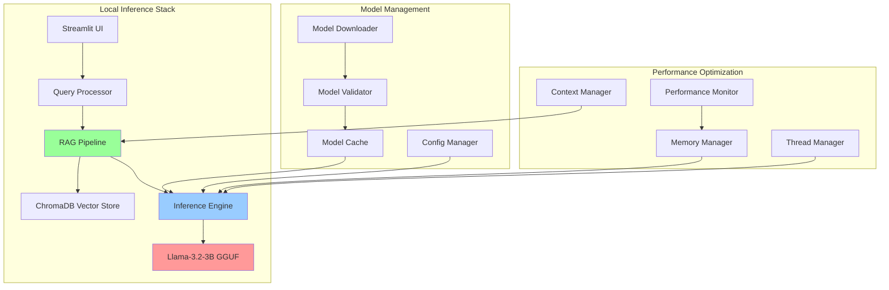

# Design Document: Phase 3 Model Optimization

## Overview

Phase 3 focuses on implementing local AI inference capabilities using Llama-3.2-3B-Instruct model optimized for 4GB RAM systems. This phase transforms the OpenClass Nexus AI from a cloud-dependent system to a fully offline-capable educational assistant that can run on resource-constrained school laptops.

The design prioritizes efficiency, reliability, and educational effectiveness while maintaining strict hardware constraints. The chosen Llama-3.2-3B-Instruct model provides the optimal balance between performance and resource usage for Indonesian educational content.

## Architecture

### System Architecture Overview



### Component Interaction Flow

1. **Query Processing**: User input → Query validation → Intent detection
2. **Knowledge Retrieval**: Semantic search in ChromaDB → Context ranking
3. **Prompt Construction**: Context + Query → Formatted prompt within token limits
4. **AI Inference**: Llama-3.2-3B generates response → Streaming output
5. **Response Processing**: Citation extraction → Format for display

## Components and Interfaces

### 1. Model Management System

#### ModelDownloader
```python
class ModelDownloader:
    def __init__(self, cache_dir: str = "./models"):
        self.cache_dir = Path(cache_dir)
        self.hf_client = HfApi()
    
    def download_model(self, model_id: str, filename: str) -> Path:
        """Download GGUF model from HuggingFace with resume capability"""
        
    def verify_model(self, model_path: Path) -> bool:
        """Verify model integrity using checksums"""
        
    def get_model_info(self, model_path: Path) -> Dict:
        """Extract model metadata and configuration"""
```

#### ModelValidator
```python
class ModelValidator:
    def validate_gguf_format(self, model_path: Path) -> bool:
        """Validate GGUF file format and structure"""
        
    def test_inference(self, model_path: Path) -> Dict:
        """Run basic inference test and measure performance"""
        
    def check_compatibility(self, model_path: Path) -> bool:
        """Check llama.cpp compatibility"""
```

### 2. Local Inference Engine

#### InferenceEngine
```python
class InferenceEngine:
    def __init__(self, model_path: str, config: InferenceConfig):
        self.model_path = model_path
        self.config = config
        self.llm = None
        self.memory_monitor = MemoryMonitor()
    
    def load_model(self) -> bool:
        """Load GGUF model with optimal configuration"""
        
    def generate_response(self, prompt: str, max_tokens: int = 512) -> Iterator[str]:
        """Generate streaming response with memory management"""
        
    def unload_model(self) -> None:
        """Safely unload model to free memory"""
```

#### InferenceConfig
```python
@dataclass
class InferenceConfig:
    n_ctx: int = 4096          # Context window size
    n_threads: int = 4         # CPU threads to use
    n_gpu_layers: int = 0      # GPU layers (0 for CPU-only)
    temperature: float = 0.7   # Response creativity
    top_p: float = 0.9         # Nucleus sampling
    max_tokens: int = 512      # Max response length
    memory_limit_mb: int = 3072  # Memory limit (3GB)
```

### 3. RAG Pipeline Integration

#### RAGPipeline
```python
class RAGPipeline:
    def __init__(self, vector_db: ChromaDB, inference_engine: InferenceEngine):
        self.vector_db = vector_db
        self.inference_engine = inference_engine
        self.context_manager = ContextManager()
    
    def process_query(self, query: str, subject_filter: str = None) -> str:
        """Process educational query with context retrieval"""
        
    def retrieve_context(self, query: str, top_k: int = 5) -> List[Document]:
        """Retrieve relevant educational content"""
        
    def construct_prompt(self, query: str, context: List[Document]) -> str:
        """Build educational prompt with Indonesian context"""
```

#### ContextManager
```python
class ContextManager:
    def __init__(self, max_context_tokens: int = 3000):
        self.max_context_tokens = max_context_tokens
        self.tokenizer = self._load_tokenizer()
    
    def fit_context(self, documents: List[Document], query: str) -> str:
        """Fit documents within token limit while preserving quality"""
        
    def rank_documents(self, documents: List[Document], query: str) -> List[Document]:
        """Rank documents by relevance for educational queries"""
```

### 4. Performance Optimization

#### MemoryMonitor
```python
class MemoryMonitor:
    def __init__(self, memory_limit_mb: int = 3072):
        self.memory_limit_mb = memory_limit_mb
        self.process = psutil.Process()
    
    def get_memory_usage(self) -> float:
        """Get current memory usage in MB"""
        
    def check_memory_available(self, required_mb: int) -> bool:
        """Check if enough memory is available"""
        
    def trigger_cleanup(self) -> None:
        """Trigger garbage collection and cleanup"""
```

#### ThreadManager
```python
class ThreadManager:
    def __init__(self):
        self.cpu_count = os.cpu_count()
        self.optimal_threads = self._calculate_optimal_threads()
    
    def _calculate_optimal_threads(self) -> int:
        """Calculate optimal thread count for current hardware"""
        
    def get_thread_config(self, available_memory_mb: int) -> int:
        """Get thread configuration based on available resources"""
```

## Data Models

### Model Configuration
```python
@dataclass
class ModelConfig:
    model_id: str = "meta-llama/Llama-3.2-3B-Instruct"
    gguf_filename: str = "Llama-3.2-3B-Instruct-Q4_K_M.gguf"
    gguf_repo: str = "bartowski/Llama-3.2-3B-Instruct-GGUF"
    local_path: Optional[Path] = None
    file_size_mb: int = 2500
    checksum: Optional[str] = None
    
    def get_download_url(self) -> str:
        return f"https://huggingface.co/{self.gguf_repo}/resolve/main/{self.gguf_filename}"
```

### Educational Prompt Template
```python
class EducationalPromptTemplate:
    SYSTEM_PROMPT = """Anda adalah asisten AI untuk pendidikan Indonesia. Jawab pertanyaan berdasarkan materi yang diberikan dengan bahasa yang mudah dipahami siswa SMA/SMK.

Aturan:
1. Gunakan bahasa Indonesia yang baik dan benar
2. Berikan penjelasan yang jelas dan terstruktur
3. Sertakan contoh jika membantu pemahaman
4. Jika tidak ada informasi yang relevan, katakan "Maaf, materi ini belum ada di database saya"
5. Selalu sertakan sumber referensi dari materi yang digunakan"""

    USER_TEMPLATE = """Konteks dari materi pembelajaran:
{context}

Pertanyaan siswa: {question}

Jawaban:"""
    
    def format_prompt(self, context: str, question: str) -> str:
        return f"{self.SYSTEM_PROMPT}\n\n{self.USER_TEMPLATE.format(context=context, question=question)}"
```

### Performance Metrics
```python
@dataclass
class PerformanceMetrics:
    response_time_ms: float
    memory_usage_mb: float
    cpu_usage_percent: float
    tokens_per_second: float
    context_tokens: int
    response_tokens: int
    timestamp: datetime
    
    def is_within_targets(self) -> bool:
        """Check if metrics meet performance targets"""
        return (
            self.response_time_ms < 10000 and  # < 10 seconds
            self.memory_usage_mb < 3072 and    # < 3GB
            self.tokens_per_second > 5         # > 5 tokens/sec
        )
```

## Correctness Properties

*A property is a characteristic or behavior that should hold true across all valid executions of a system-essentially, a formal statement about what the system should do. Properties serve as the bridge between human-readable specifications and machine-verifiable correctness guarantees.*

### Property Reflection

After analyzing all acceptance criteria, I identified several areas where properties can be consolidated:
- Model evaluation properties (1.1-1.5) can be combined into comprehensive model selection validation
- Download and validation properties (2.1-2.5) share common integrity verification patterns
- Quantization properties (3.1-3.5) follow similar validation patterns
- Performance properties (5.1-5.5) can be unified under performance monitoring
- Configuration properties (8.1-8.5) share auto-detection and validation patterns

### Core Properties

**Property 1: Model Selection Validation**
*For any* model evaluation process, all specified models (Llama-3.2-3B-Instruct, Mistral-7B-Instruct-v0.3, Qwen2.5-7B-Instruct) should be evaluated with Indonesian language support prioritization and educational Q&A performance metrics
**Validates: Requirements 1.1, 1.2, 1.3, 1.5**

**Property 2: Model Size and Quality Constraints**
*For any* selected model, when quantized to Q4_K_M format, the resulting file should be under 5GB while maintaining coherent output quality
**Validates: Requirements 1.4, 3.5, 3.4**

**Property 3: Download Integrity and Organization**
*For any* model download operation, the system should use HuggingFace Hub, verify educational licenses, validate checksums, and organize files in structured directories
**Validates: Requirements 2.1, 2.2, 2.4, 2.5**

**Property 4: Download Resumption**
*For any* interrupted download, the system should be able to resume from the correct position without data corruption
**Validates: Requirements 2.3**

**Property 5: Quantization Tool and Format Compliance**
*For any* model quantization, the system should use llama.cpp tools, apply Q4_K_M format, and preserve all metadata and tokenizer information
**Validates: Requirements 3.1, 3.2, 3.3**

**Property 6: Inference Engine Configuration**
*For any* inference engine setup, the system should use llama-cpp-python bindings, set context window to 4096 tokens, and support streaming output
**Validates: Requirements 4.1, 4.2, 4.5**

**Property 7: Resource Utilization and Management**
*For any* inference operation, the system should efficiently utilize available CPU cores while maintaining memory usage under 3GB and preventing OOM errors on 4GB systems
**Validates: Requirements 4.3, 4.4, 5.3**

**Property 8: Performance Requirements**
*For any* typical educational query, the system should respond within 10 seconds while supporting batch processing and graceful degradation under resource constraints
**Validates: Requirements 5.1, 5.2, 5.4**

**Property 9: Educational Content Integration**
*For any* query processing, the system should retrieve relevant chunks from ChromaDB, use retrieved content as model context, include source attribution, and fit within context window limits
**Validates: Requirements 6.1, 6.2, 6.3, 6.4**

**Property 10: Fallback Response Handling**
*For any* query with no relevant content found, the system should generate appropriate fallback responses
**Validates: Requirements 6.5**

**Property 11: Model Distribution and Versioning**
*For any* model packaging, the system should create compressed archives with metadata, use S3/CloudFront distribution, implement semantic versioning, and provide checksums
**Validates: Requirements 7.1, 7.2, 7.3, 7.4**

**Property 12: Delta Update Support**
*For any* model update, the system should support incremental updates to minimize bandwidth usage
**Validates: Requirements 7.5**

**Property 13: Hardware Adaptation and Configuration**
*For any* deployment environment, the system should auto-detect optimal configuration, provide customizable settings for threads and memory, and adapt context window size for low-spec hardware
**Validates: Requirements 8.1, 8.2, 8.3, 8.4**

**Property 14: Performance Monitoring and Logging**
*For any* system operation, performance metrics and error information should be logged for troubleshooting, and Indonesian educational content should be included in benchmarking
**Validates: Requirements 8.5, 5.5**

<function_calls>
<invoke name="prework">
<parameter name="featureName">phase3-model-optimization

## Error Handling

### Model Download Errors
- **Network Interruption**: Implement automatic retry with exponential backoff
- **Insufficient Storage**: Check available disk space before download
- **Corrupted Downloads**: Validate checksums and re-download if necessary
- **Authentication Errors**: Provide clear error messages for HuggingFace access issues

### Model Loading Errors
- **Insufficient Memory**: Gracefully degrade by reducing context window or batch size
- **Corrupted Model Files**: Validate GGUF format and re-download if necessary
- **Incompatible Hardware**: Detect CPU capabilities and adjust configuration
- **Missing Dependencies**: Check for llama.cpp installation and provide setup guidance

### Inference Errors
- **Out of Memory**: Implement memory monitoring and automatic cleanup
- **Context Overflow**: Truncate context intelligently while preserving important information
- **Generation Timeout**: Set reasonable timeouts and provide partial responses
- **Model Unresponsive**: Implement health checks and model restart capabilities

### Integration Errors
- **ChromaDB Connection**: Handle database unavailability with appropriate fallbacks
- **Vector Search Failures**: Provide graceful degradation to keyword search
- **Prompt Construction Errors**: Validate prompt format and token limits
- **Response Processing Errors**: Handle malformed model outputs gracefully

## Testing Strategy

### Dual Testing Approach
The testing strategy combines unit tests for specific functionality with property-based tests for comprehensive validation across all inputs.

#### Unit Testing Focus
- **Model Download**: Test specific download scenarios and error conditions
- **GGUF Validation**: Test model format validation with known good/bad files
- **Configuration Loading**: Test configuration parsing with various input formats
- **Memory Management**: Test memory monitoring with simulated resource constraints
- **Prompt Construction**: Test educational prompt formatting with various inputs

#### Property-Based Testing Focus
- **Model Selection**: Test selection algorithm across various model candidates (Property 1)
- **Download Integrity**: Test download and validation across various file sizes and network conditions (Property 3)
- **Quantization Validation**: Test quantization process across different model types (Property 5)
- **Performance Requirements**: Test response times across various query types and system loads (Property 8)
- **Resource Management**: Test memory and CPU utilization across different hardware configurations (Property 7)

#### Testing Configuration
- **Minimum 100 iterations** per property test due to randomization
- **Test Environment**: Simulated 4GB RAM constraints using Docker containers
- **Performance Benchmarks**: Indonesian educational queries from actual curriculum content
- **Hardware Simulation**: Test across different CPU core counts and memory configurations

#### Property Test Tags
Each property test must reference its design document property:
- **Feature: phase3-model-optimization, Property 1**: Model Selection Validation
- **Feature: phase3-model-optimization, Property 8**: Performance Requirements
- **Feature: phase3-model-optimization, Property 13**: Hardware Adaptation and Configuration

### Integration Testing
- **End-to-End Workflows**: Complete model download → quantization → inference pipeline
- **RAG Pipeline Integration**: Test with actual ChromaDB and educational content
- **Performance Under Load**: Test concurrent queries and memory pressure scenarios
- **Offline Functionality**: Test complete system operation without internet connectivity

### Educational Content Validation
- **Indonesian Language Quality**: Test responses for grammatical correctness and educational appropriateness
- **Source Attribution**: Validate that all responses include proper citations
- **Curriculum Alignment**: Test responses against official BSE Kemdikbud content standards
- **Fallback Behavior**: Test appropriate responses when no relevant content is available