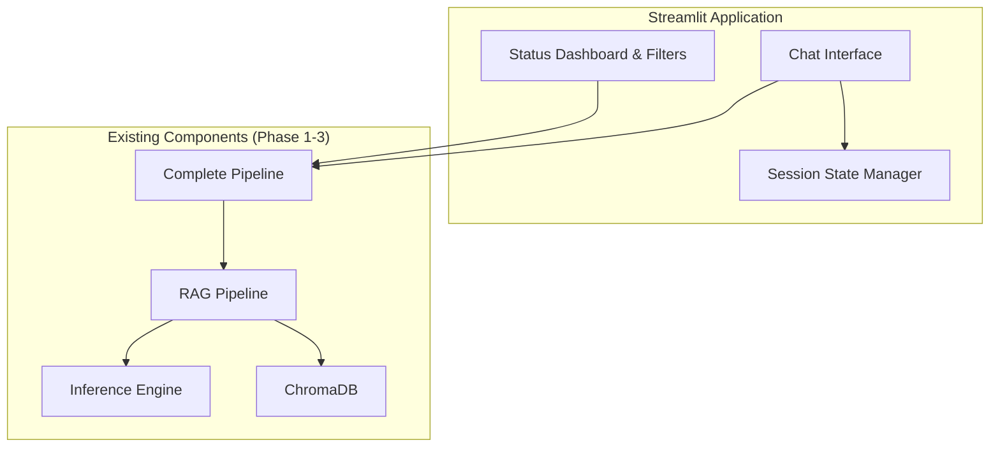

# Design Document

## Overview

The Phase 4 Local Application is a Streamlit-based user interface that provides an offline AI tutoring experience for Indonesian schools. The application integrates with existing Phase 1-3 components (RAG pipeline, inference engine, vector database) to deliver a chat-based interface where teachers and students can ask questions and receive answers with source citations.

The design prioritizes:
- **Offline-first operation**: Works completely offline after initial setup
- **Memory efficiency**: Optimized for 4GB RAM systems through lazy loading and session state management
- **Simple UX**: Clean chat interface with minimal configuration
- **Educational focus**: Source citations and subject filtering for curriculum-aligned learning

## Architecture

### High-Level Architecture



### Component Interaction Flow

1. **Initialization Flow**:
   - Streamlit app starts → Initialize session state
   - Lazy load Complete_Pipeline on first query
   - Display loading status in sidebar

2. **Query Processing Flow**:
   - User enters question → Store in session state
   - Pass to Complete_Pipeline with subject filter
   - Stream response tokens to UI
   - Display sources and update chat history

3. **State Management Flow**:
   - All chat history stored in st.session_state
   - Pipeline instance cached in st.session_state
   - No disk persistence (session-only)

## Components and Interfaces

### 1. Main Application Module (app.py)

**Responsibility**: Entry point for the Streamlit application, orchestrates UI components and pipeline integration.

**Key Functions**:
```python
def main():
    """Main application entry point"""
    # Initialize session state
    # Render sidebar (status + filters)
    # Render chat interface
    # Handle user input
    pass

def initialize_session_state():
    """Initialize Streamlit session state variables"""
    # chat_history: List[Dict]
    # pipeline: Optional[CompletePipeline]
    # pipeline_initialized: bool
    # current_subject_filter: str
    pass
```

### 2. Pipeline Manager Module (src/ui/pipeline_manager.py)

**Responsibility**: Manages the Complete_Pipeline lifecycle with lazy loading and error handling.

**Interface**:
```python
class PipelineManager:
    def __init__(self):
        self.pipeline: Optional[CompletePipeline] = None
        self.initialization_error: Optional[str] = None
    
    def initialize_pipeline(self) -> bool:
        """
        Lazy initialize the Complete_Pipeline.
        Returns True if successful, False otherwise.
        """
        pass
    
    def get_pipeline(self) -> Optional[CompletePipeline]:
        """Get the initialized pipeline or None if not ready"""
        pass
    
    def get_status(self) -> Dict[str, Any]:
        """Get pipeline status for dashboard display"""
        pass
    
    def process_query(self, query: str, subject_filter: Optional[str]) -> Iterator[str]:
        """
        Process query and yield response tokens for streaming.
        Raises RuntimeError if pipeline not initialized.
        """
        pass
```

### 3. Chat Interface Module (src/ui/chat_interface.py)

**Responsibility**: Renders the chat UI with message history and input handling.

**Interface**:
```python
def render_chat_interface(
    chat_history: List[Dict[str, Any]],
    pipeline_manager: PipelineManager,
    subject_filter: str
) -> None:
    """
    Render the chat interface with message history and input.
    
    Args:
        chat_history: List of message dicts with 'role', 'content', 'sources'
        pipeline_manager: Pipeline manager for query processing
        subject_filter: Current subject filter selection
    """
    pass

def display_message(message: Dict[str, Any]) -> None:
    """Display a single chat message with sources"""
    pass

def display_sources(sources: List[Dict[str, Any]]) -> None:
    """Display source citations below a message"""
    pass

def stream_response(
    query: str,
    pipeline_manager: PipelineManager,
    subject_filter: str
) -> Dict[str, Any]:
    """
    Stream response from pipeline and return complete message dict.
    Returns dict with 'role', 'content', 'sources', 'processing_time_ms'
    """
    pass
```

### 4. Status Dashboard Module (src/ui/status_dashboard.py)

**Responsibility**: Displays system status in the sidebar.

**Interface**:
```python
def render_status_dashboard(pipeline_manager: PipelineManager) -> None:
    """
    Render status dashboard in sidebar showing:
    - Database status (loaded/not loaded, document count)
    - Model status (ready/loading/error)
    - Memory usage
    - Last update timestamp
    """
    pass

def get_status_indicator(status: str) -> str:
    """
    Get emoji indicator for status.
    Returns: "🟢" for ready, "🟡" for loading, "🔴" for error
    """
    pass

def format_memory_usage(memory_mb: float) -> str:
    """Format memory usage with warning if > 2.5GB"""
    pass
```

### 5. Subject Filter Module (src/ui/subject_filter.py)

**Responsibility**: Renders subject filter dropdown in sidebar.

**Interface**:
```python
SUBJECTS = ["Semua", "Matematika", "IPA", "Bahasa Indonesia", "Informatika"]

def render_subject_filter() -> str:
    """
    Render subject filter dropdown in sidebar.
    Returns selected subject as string.
    """
    pass

def map_subject_to_filter(subject: str) -> Optional[str]:
    """
    Map UI subject name to filter value for pipeline.
    "Semua" -> None, others -> lowercase subject name
    """
    pass
```

### 6. Error Handler Module (src/ui/error_handler.py)

**Responsibility**: Provides Indonesian error messages and recovery suggestions.

**Interface**:
```python
class ErrorMessages:
    """Indonesian error messages for common failure scenarios"""
    EMPTY_DATABASE = "Database kosong. Silakan jalankan pipeline ETL terlebih dahulu."
    MODEL_LOAD_FAILED = "Model gagal dimuat. Periksa file model di {path}."
    QUERY_FAILED = "Terjadi kesalahan. Silakan coba lagi."
    INSUFFICIENT_MEMORY = "Memori tidak cukup. Tutup aplikasi lain dan coba lagi."
    PIPELINE_INIT_FAILED = "Gagal menginisialisasi sistem: {error}"

def get_error_message(error_type: str, **kwargs) -> str:
    """Get formatted error message in Indonesian"""
    pass

def display_error(error_message: str, show_details: bool = False) -> None:
    """Display error in Streamlit UI with optional details"""
    pass
```

## Data Models

### ChatMessage

Represents a single message in the chat history.

```python
@dataclass
class ChatMessage:
    role: str  # "user" or "assistant"
    content: str  # Message text
    sources: List[SourceCitation] = field(default_factory=list)
    timestamp: datetime = field(default_factory=datetime.now)
    processing_time_ms: Optional[float] = None
```

### SourceCitation

Represents a source citation for an assistant response.

```python
@dataclass
class SourceCitation:
    filename: str  # Source book filename
    subject: str  # Subject (e.g., "Matematika")
    relevance_score: float  # 0.0 to 1.0
    chunk_index: int  # Chunk index in source document
    
    def format_citation(self) -> str:
        """Format as: 📚 [Subject] - [Filename] (Relevance: [Score])"""
        return f"📚 {self.subject} - {self.filename} (Relevance: {self.relevance_score:.2f})"
```

### PipelineStatus

Represents the current status of the pipeline for dashboard display.

```python
@dataclass
class PipelineStatus:
    database_loaded: bool
    database_document_count: int
    model_loaded: bool
    memory_usage_mb: float
    last_update: datetime
    error_message: Optional[str] = None
    
    def get_database_status_text(self) -> str:
        """Returns: 'Database: Loaded (N documents)' or 'Database: Not Loaded'"""
        pass
    
    def get_model_status_text(self) -> str:
        """Returns: 'Model: Ready' or 'Model: Loading' or 'Model: Error'"""
        pass
    
    def has_memory_warning(self) -> bool:
        """Returns True if memory usage > 2.5GB"""
        return self.memory_usage_mb > 2500
```

### SessionState

Represents the Streamlit session state structure.

```python
# Stored in st.session_state
{
    "chat_history": List[ChatMessage],  # All messages in current session
    "pipeline_manager": Optional[PipelineManager],  # Cached pipeline manager
    "pipeline_initialized": bool,  # Whether pipeline has been initialized
    "current_subject_filter": str,  # Current subject filter selection
    "initialization_attempted": bool,  # Whether initialization was attempted
}
```


## Correctness Properties

A property is a characteristic or behavior that should hold true across all valid executions of a system—essentially, a formal statement about what the system should do. Properties serve as the bridge between human-readable specifications and machine-verifiable correctness guarantees.

### Property 1: Question Display in Chat History

*For any* user-submitted question, adding it to the chat interface should result in the question appearing in the session chat history immediately.

**Validates: Requirements 1.2**

### Property 2: Response Streaming

*For any* query processed by the RAG_Pipeline, the system should yield response tokens incrementally rather than returning the complete response at once.

**Validates: Requirements 1.3, 5.4, 9.1**

### Property 3: Source Citation Completeness

*For any* response generated with sources, each source citation should include filename, subject, and relevance score in the format "📚 [Subject] - [Filename] (Relevance: [Score])".

**Validates: Requirements 1.4, 6.1, 6.2, 6.3, 6.5**

### Property 4: Subject Filter Propagation

*For any* subject filter selection (including "Semua"), the system should correctly map the UI selection to the pipeline filter parameter (None for "Semua", lowercase subject name for specific subjects).

**Validates: Requirements 1.5, 8.3**

### Property 5: Chat History Accumulation

*For any* question-response pair, both the question and response should be appended to the session chat history in order.

**Validates: Requirements 2.1**

### Property 6: Session State Persistence

*For any* chat history state, after a Streamlit rerun, the session state should contain the same chat history that was present before the rerun.

**Validates: Requirements 2.2**

### Property 7: No Disk Persistence

*For any* chat session, no files should be created on disk for storing chat history (all history remains in memory only).

**Validates: Requirements 2.4**

### Property 8: Status Display Accuracy

*For any* pipeline state, the status dashboard should accurately reflect the current state of the database (loaded/not loaded with document count) and model (ready/loading/error).

**Validates: Requirements 3.3, 3.4**

### Property 9: Error Message Localization

*For any* error condition, the system should display error messages in Indonesian language with appropriate context.

**Validates: Requirements 4.4, 7.5**

### Property 10: Lazy Initialization

*For any* application startup, the Inference_Engine and Vector_DB should not be loaded until the first query is submitted.

**Validates: Requirements 5.1, 5.2**

### Property 11: Pipeline Instance Reuse

*For any* session, all queries should use the same Complete_Pipeline instance (verified by object identity).

**Validates: Requirements 5.5**

### Property 12: Filter Application Timing

*For any* subject filter change, the new filter should only apply to queries submitted after the change, not to existing chat history.

**Validates: Requirements 8.4**

### Property 13: Active Filter Display

*For any* subject filter selection, the current filter value should be visible in the chat interface.

**Validates: Requirements 8.5**

### Property 14: Typing Indicator Lifecycle

*For any* streaming response, a typing indicator should be displayed while streaming is active and removed when streaming completes.

**Validates: Requirements 9.2, 9.3**

### Property 15: UI Language Consistency

*For any* UI element (labels, messages, errors), the text should be in Indonesian language.

**Validates: Requirements 10.4**

## Error Handling

### Error Categories

1. **Initialization Errors**:
   - Missing model file → Display path and suggest download
   - Empty vector database → Suggest running ETL pipeline
   - Insufficient memory → Suggest closing other applications
   - Pipeline initialization failure → Display error reason and recovery steps

2. **Query Processing Errors**:
   - Query processing failure → Display generic error message
   - Streaming interruption → Display partial response with error
   - Memory exhaustion during query → Display memory error

3. **State Management Errors**:
   - Session state corruption → Reinitialize session state
   - Pipeline instance failure → Attempt reinitialization

### Error Handling Strategy

All errors should:
- Display user-friendly messages in Indonesian
- Log full error details to console for debugging
- Provide recovery suggestions where applicable
- Maintain application stability (no crashes)

### Error Message Mapping

```python
ERROR_MESSAGES = {
    "empty_database": "Database kosong. Silakan jalankan pipeline ETL terlebih dahulu.",
    "model_load_failed": "Model gagal dimuat. Periksa file model di {path}.",
    "query_failed": "Terjadi kesalahan. Silakan coba lagi.",
    "insufficient_memory": "Memori tidak cukup. Tutup aplikasi lain dan coba lagi.",
    "pipeline_init_failed": "Gagal menginisialisasi sistem: {error}",
}
```

## Testing Strategy

### Dual Testing Approach

The testing strategy combines unit tests for specific examples and edge cases with property-based tests for universal properties:

**Unit Tests** focus on:
- Initial UI state verification (empty chat, correct layout)
- Specific error message content (Indonesian text validation)
- Edge cases (empty database, missing model, >50 messages)
- Integration points (pipeline initialization, session state setup)

**Property-Based Tests** focus on:
- Chat history accumulation across random question sequences
- Source citation format consistency across random responses
- Filter propagation across random subject selections
- Session state persistence across random state changes
- Streaming behavior across random query inputs
- Language consistency across all UI elements

### Property Test Configuration

All property-based tests should:
- Run minimum 100 iterations per test
- Use appropriate generators for test data (random questions, subjects, responses)
- Tag each test with: **Feature: phase4-local-application, Property {number}: {property_text}**
- Use Python's `hypothesis` library for property-based testing

### Test Organization

```
tests/
├── unit/
│   ├── test_chat_interface.py       # UI component tests
│   ├── test_status_dashboard.py     # Dashboard display tests
│   ├── test_pipeline_manager.py     # Pipeline lifecycle tests
│   └── test_error_handler.py        # Error message tests
├── property/
│   ├── test_chat_properties.py      # Chat history and streaming properties
│   ├── test_filter_properties.py    # Subject filter properties
│   ├── test_state_properties.py     # Session state properties
│   └── test_source_properties.py    # Source citation properties
└── integration/
    └── test_app_integration.py      # End-to-end app tests
```

### Key Test Scenarios

1. **Initial State Tests** (Unit):
   - Verify empty chat history on startup
   - Verify sidebar contains status dashboard and filter
   - Verify main area contains chat interface

2. **Chat History Tests** (Property):
   - Property: Adding N random questions results in N messages in history
   - Property: Session state preserves history across reruns

3. **Streaming Tests** (Property):
   - Property: Responses are yielded in multiple chunks
   - Property: Typing indicator appears during streaming

4. **Source Citation Tests** (Property):
   - Property: All sources include filename, subject, and score
   - Property: Citation format matches expected pattern

5. **Filter Tests** (Property):
   - Property: "Semua" maps to None filter
   - Property: Specific subjects map to lowercase names
   - Property: Filter changes don't affect past queries

6. **Error Handling Tests** (Unit):
   - Edge case: Empty database shows correct Indonesian message
   - Edge case: Missing model shows path in error message
   - Edge case: Memory error shows correct Indonesian message

7. **Performance Tests** (Manual):
   - Initialization completes within 30 seconds
   - Memory usage stays below 3GB during idle
   - UI updates at least every 100ms during streaming

### Mocking Strategy

For testing UI components without full pipeline:
- Mock `PipelineManager` to return controlled responses
- Mock `CompletePipeline` to simulate different states
- Use `st.testing` utilities for Streamlit component testing
- Mock streaming responses with controlled token sequences

### Test Data Generators

For property-based tests:
```python
# Hypothesis strategies for test data generation
@st.composite
def chat_messages(draw):
    """Generate random chat messages"""
    role = draw(st.sampled_from(["user", "assistant"]))
    content = draw(st.text(min_size=1, max_size=500))
    return {"role": role, "content": content}

@st.composite
def source_citations(draw):
    """Generate random source citations"""
    filename = draw(st.text(min_size=1, max_size=100))
    subject = draw(st.sampled_from(["Matematika", "IPA", "Bahasa Indonesia", "Informatika"]))
    score = draw(st.floats(min_value=0.0, max_value=1.0))
    return SourceCitation(filename=filename, subject=subject, relevance_score=score, chunk_index=0)

@st.composite
def subject_filters(draw):
    """Generate random subject filter selections"""
    return draw(st.sampled_from(["Semua", "Matematika", "IPA", "Bahasa Indonesia", "Informatika"]))
```
