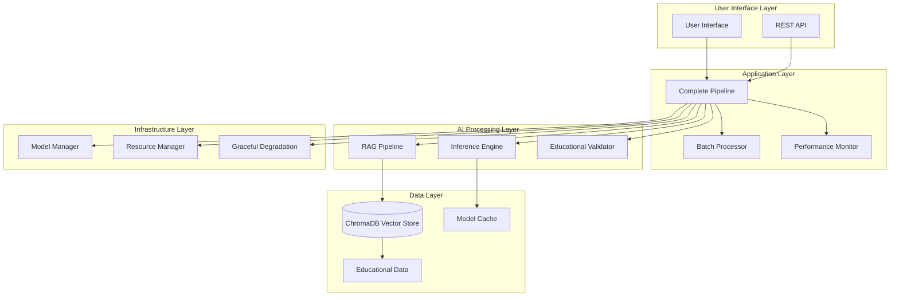
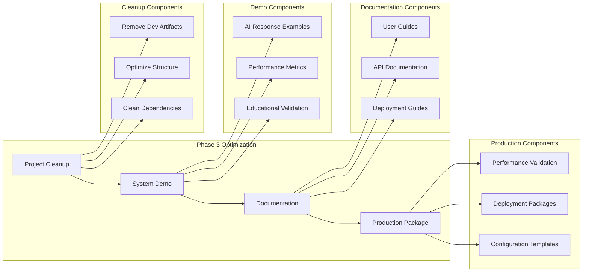

# Design Document - Project Optimization Phase 3

## Overview

This design outlines the comprehensive optimization strategy for OpenClass Nexus AI after Phase 3 completion. The system has achieved 83.3% validation score and is production-ready. This optimization phase will clean up development artifacts, enhance documentation, demonstrate system capabilities, and prepare for production deployment.

The optimization focuses on four key areas:
1. **Project Structure Cleanup** - Remove development artifacts and optimize directory structure
2. **System Demonstration** - Show actual AI model outputs and capabilities
3. **Documentation Enhancement** - Create comprehensive guides similar to Phase 2 quality
4. **Production Readiness** - Validate performance and prepare deployment packages

## Architecture

### Current System Architecture



### Optimization Architecture



## Components and Interfaces

### 1. Project Cleanup Manager

**Purpose**: Automate removal of development artifacts and optimize project structure.

**Key Components**:
- **File Cleanup Engine**: Remove temporary files, test artifacts, and cache files
- **Directory Optimizer**: Reorganize project structure for production
- **Dependency Cleaner**: Remove unused dependencies and optimize requirements

**Interface**:
```python
class ProjectCleanupManager:
    def cleanup_development_artifacts(self) -> CleanupReport
    def optimize_directory_structure(self) -> StructureReport
    def validate_production_readiness(self) -> ValidationReport
    def generate_cleanup_summary(self) -> Dict[str, Any]
```

### 2. System Demonstration Engine

**Purpose**: Generate comprehensive examples of AI model capabilities and outputs.

**Key Components**:
- **Query Processor**: Process sample educational queries
- **Response Generator**: Generate AI responses with metrics
- **Performance Benchmarker**: Measure and report system performance
- **Educational Content Validator**: Validate curriculum alignment

**Interface**:
```python
class SystemDemonstrationEngine:
    def generate_sample_responses(self, queries: List[str]) -> List[DemoResponse]
    def run_performance_benchmark(self) -> PerformanceBenchmark
    def validate_educational_content(self) -> ValidationResults
    def create_demonstration_report(self) -> DemonstrationReport
```

### 3. Documentation Generator

**Purpose**: Create comprehensive documentation similar to Phase 2 quality.

**Key Components**:
- **User Guide Generator**: Create step-by-step user guides
- **API Documentation Builder**: Generate complete API reference
- **Deployment Guide Creator**: Create production deployment instructions
- **Troubleshooting Guide Builder**: Document common issues and solutions

**Interface**:
```python
class DocumentationGenerator:
    def generate_user_guide(self, language: str = "indonesian") -> UserGuide
    def create_api_documentation(self) -> APIDocumentation
    def build_deployment_guide(self) -> DeploymentGuide
    def create_troubleshooting_guide(self) -> TroubleshootingGuide
```

### 4. Production Readiness Validator

**Purpose**: Validate system performance and create deployment packages.

**Key Components**:
- **Performance Validator**: Validate all performance requirements
- **System Health Checker**: Comprehensive health check of all components
- **Package Builder**: Create distributable deployment packages
- **Configuration Manager**: Generate environment-specific configurations

**Interface**:
```python
class ProductionReadinessValidator:
    def validate_performance_requirements(self) -> PerformanceValidation
    def run_comprehensive_health_check(self) -> HealthCheckReport
    def create_deployment_package(self) -> DeploymentPackage
    def generate_configuration_templates(self) -> ConfigurationTemplates
```

## Data Models

### Cleanup Report
```python
@dataclass
class CleanupReport:
    files_removed: int
    directories_cleaned: int
    cache_cleared_mb: float
    space_freed_mb: float
    cleanup_duration_seconds: float
    issues_encountered: List[str]
    recommendations: List[str]
```

### Demo Response
```python
@dataclass
class DemoResponse:
    query: str
    response: str
    response_time_ms: float
    memory_usage_mb: float
    curriculum_alignment_score: float
    language_quality_score: float
    sources_used: List[str]
    confidence_score: float
    educational_grade: str
```

### Performance Benchmark
```python
@dataclass
class PerformanceBenchmark:
    average_response_time_ms: float
    peak_memory_usage_mb: float
    throughput_queries_per_minute: float
    concurrent_query_capacity: int
    curriculum_alignment_accuracy: float
    system_stability_score: float
    hardware_efficiency_score: float
```

### Documentation Package
```python
@dataclass
class DocumentationPackage:
    user_guide_path: str
    api_documentation_path: str
    deployment_guide_path: str
    troubleshooting_guide_path: str
    examples_directory: str
    language_versions: List[str]
    last_updated: datetime
```

## Correctness Properties

*A property is a characteristic or behavior that should hold true across all valid executions of a system-essentially, a formal statement about what the system should do. Properties serve as the bridge between human-readable specifications and machine-verifiable correctness guarantees.*

Based on the prework analysis, I've identified the following testable properties:

### Property Reflection

After reviewing all properties identified in the prework, I found several areas where properties can be consolidated:
- Properties 2.1, 6.1, 6.2, 6.3 all relate to AI response quality and can be combined into comprehensive response validation
- Properties 4.1, 4.2, 4.3, 4.4, 4.5 all relate to performance validation and can be consolidated
- Properties 3.2, 5.1, 5.2, 5.5 all relate to comprehensive reporting and can be combined

### Core Properties

**Property 1: Cleanup Preserves Essential Functionality**
*For any* project directory with essential files and temporary artifacts, running cleanup should remove all temporary files while preserving all essential functionality and configuration files
**Validates: Requirements 1.1, 1.3**

**Property 2: AI Response Quality and Curriculum Alignment**
*For any* educational query in Indonesian, the AI system should generate responses that are curriculum-aligned, age-appropriate for grade 10, use proper Indonesian grammar and educational terminology, and include proper source attribution when references are used
**Validates: Requirements 2.1, 6.1, 6.2, 6.3, 6.4, 6.5**

**Property 3: Batch Processing with Performance Metrics**
*For any* set of educational queries, batch processing should handle them concurrently while providing comprehensive performance metrics including response time, memory usage, and throughput
**Validates: Requirements 2.2, 2.4**

**Property 4: RAG Pipeline Content Retrieval**
*For any* educational query, the RAG pipeline should retrieve relevant educational content from the knowledge base and provide proper source attribution to BSE Kemdikbud resources
**Validates: Requirements 2.3, 6.4**

**Property 5: Educational Content Validation**
*For any* educational content or response, the validation system should assess curriculum alignment and content quality with numerical scoring
**Validates: Requirements 2.5**

**Property 6: API Documentation Completeness**
*For any* public function or method in the system, API documentation should include complete function references with examples and parameters
**Validates: Requirements 3.2**

**Property 7: Performance Requirements Compliance**
*For any* system operation, performance should meet all specified requirements: response times under 5 seconds, memory usage within 4GB constraints, support for 3 concurrent queries, above 85% curriculum alignment accuracy, and stable operation during extended periods
**Validates: Requirements 4.1, 4.2, 4.3, 4.4, 4.5**

**Property 8: Component Status Reporting**
*For any* system component evaluation, status reports should be generated for all major components with pass/fail indicators
**Validates: Requirements 5.1**

**Property 9: Deployment Package Completeness**
*For any* deployment package creation, the generated package should contain all necessary dependencies and configuration files required for deployment
**Validates: Requirements 5.2**

**Property 10: Comprehensive Metrics Reporting**
*For any* metrics compilation request, the system should provide comprehensive reports covering all technical achievements and educational impact metrics
**Validates: Requirements 5.5**

<function_calls>
<invoke name="prework">
<parameter name="featureName">project-optimization-phase3

## Error Handling

### Cleanup Error Handling
- **File Access Errors**: Handle permission issues and locked files gracefully
- **Directory Structure Errors**: Validate directory structure before and after cleanup
- **Rollback Capability**: Provide rollback mechanism if cleanup fails partially

### System Demonstration Error Handling
- **Model Loading Failures**: Graceful degradation when AI model cannot be loaded
- **Performance Monitoring Failures**: Continue demonstration with limited metrics if monitoring fails
- **Educational Validation Failures**: Provide basic validation if advanced validation fails

### Documentation Generation Error Handling
- **Template Missing Errors**: Use fallback templates if primary templates are unavailable
- **Content Generation Failures**: Generate partial documentation with clear indicators of missing sections
- **Language Support Errors**: Fall back to English if Indonesian generation fails

### Production Validation Error Handling
- **Performance Test Failures**: Provide detailed failure analysis and recommendations
- **Health Check Failures**: Generate comprehensive failure reports with remediation steps
- **Package Creation Failures**: Provide detailed error logs and dependency resolution guidance

## Testing Strategy

### Dual Testing Approach
The system will use both unit testing and property-based testing for comprehensive coverage:

**Unit Tests**: Focus on specific examples, edge cases, and error conditions
- Specific cleanup scenarios with known file structures
- Example documentation generation with sample content
- Integration points between optimization components
- Error conditions and edge cases

**Property-Based Tests**: Verify universal properties across all inputs
- Cleanup operations with randomly generated file structures
- AI response quality across randomly generated educational queries
- Performance validation across various system loads
- Documentation completeness across different system configurations

### Property-Based Testing Configuration
- **Testing Framework**: Hypothesis (Python) for property-based testing
- **Minimum Iterations**: 100 iterations per property test
- **Test Tagging**: Each property test tagged with format: **Feature: project-optimization-phase3, Property {number}: {property_text}**

### Testing Implementation Requirements
- Each correctness property must be implemented by a single property-based test
- Property tests should run minimum 100 iterations due to randomization
- Unit tests complement property tests by testing specific examples and edge cases
- Both testing approaches are necessary for comprehensive coverage

### Test Categories

**Cleanup Testing**:
- Property tests for file cleanup with random directory structures
- Unit tests for specific cleanup scenarios and error conditions
- Integration tests for complete cleanup workflow

**System Demonstration Testing**:
- Property tests for AI response quality across random educational queries
- Unit tests for specific demonstration scenarios
- Performance benchmark validation tests

**Documentation Testing**:
- Property tests for documentation completeness across random system configurations
- Unit tests for specific documentation generation scenarios
- Language support validation tests

**Production Readiness Testing**:
- Property tests for performance requirements across various loads
- Unit tests for specific deployment scenarios
- Health check validation tests

### Performance Testing Strategy
- **Load Testing**: Validate system performance under various loads
- **Stress Testing**: Test system behavior at resource limits
- **Endurance Testing**: Validate system stability over extended periods
- **Concurrent Testing**: Validate multi-user scenarios

### Validation Testing Strategy
- **Educational Content Validation**: Test curriculum alignment across various subjects
- **Language Quality Validation**: Test Indonesian language quality and grammar
- **Source Attribution Validation**: Test proper citation of educational resources
- **Age Appropriateness Validation**: Test content suitability for grade 10 students

## Implementation Workflow

### Phase 1: Project Cleanup
1. **Artifact Identification**: Scan project for development artifacts
2. **Essential File Validation**: Identify and protect essential files
3. **Cleanup Execution**: Remove temporary files and optimize structure
4. **Validation**: Verify system functionality after cleanup

### Phase 2: System Demonstration
1. **Sample Query Preparation**: Prepare diverse educational queries
2. **AI Response Generation**: Generate responses with full metrics
3. **Performance Benchmarking**: Measure system performance comprehensively
4. **Educational Validation**: Validate curriculum alignment and quality

### Phase 3: Documentation Enhancement
1. **User Guide Creation**: Create comprehensive user guides in Indonesian and English
2. **API Documentation**: Generate complete API reference with examples
3. **Deployment Guide**: Create production deployment instructions
4. **Troubleshooting Guide**: Document common issues and solutions

### Phase 4: Production Readiness
1. **Performance Validation**: Validate all performance requirements
2. **Health Check**: Comprehensive system health validation
3. **Package Creation**: Generate deployment packages
4. **Configuration Templates**: Create environment-specific configurations

### Integration Points
- **Continuous Integration**: Integrate optimization into CI/CD pipeline
- **Monitoring Integration**: Connect with existing monitoring systems
- **Documentation Integration**: Link with existing documentation systems
- **Deployment Integration**: Integrate with deployment automation

## Success Metrics

### Technical Metrics
- **Cleanup Efficiency**: Percentage of artifacts removed vs. space freed
- **System Performance**: Response time, memory usage, throughput metrics
- **Documentation Coverage**: Percentage of functions/features documented
- **Production Readiness Score**: Comprehensive system validation score

### Educational Metrics
- **Curriculum Alignment**: Percentage of responses aligned with Indonesian curriculum
- **Language Quality**: Indonesian language grammar and terminology accuracy
- **Educational Effectiveness**: Age-appropriateness and pedagogical structure scores
- **Source Attribution**: Accuracy of educational resource citations

### Quality Metrics
- **Test Coverage**: Unit and property test coverage percentages
- **Error Rate**: System error rate during optimization and demonstration
- **User Experience**: Documentation clarity and usability scores
- **Deployment Success**: Success rate of deployment package creation and usage