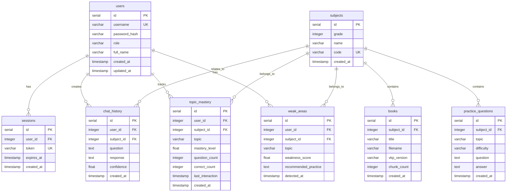

# Database Schema Documentation

## Overview

OpenClass Nexus AI uses PostgreSQL as its persistence layer for storing user data, sessions, chat history, curriculum metadata, and pedagogical tracking information. This document provides comprehensive documentation of the database schema, relationships, indexes, and usage patterns.

### Database Architecture

- **Database System**: PostgreSQL 12 or later
- **Connection Pooling**: pool_size=10, max_overflow=20
- **Access**: Localhost only (security constraint)
- **Backup Strategy**: Weekly full backups, daily incremental backups
- **Retention**: 28-day backup retention policy

### Design Principles

1. **Privacy by Architecture**: All sensitive data (chat history, user information) stored locally only
2. **Data Integrity**: Foreign key constraints and check constraints enforce referential integrity
3. **Performance**: Strategic indexes on frequently queried columns
4. **Scalability**: Supports up to 500 students per school server, 1 million chat history records
5. **Auditability**: Timestamps on all tables for tracking data lifecycle

---

## Entity Relationship Diagram



---

## Table Definitions

### 1. users

Stores user accounts for students, teachers, and administrators.

**Purpose**: Authentication and user management

**Columns**:

| Column | Type | Constraints | Description |
|--------|------|-------------|-------------|
| id | SERIAL | PRIMARY KEY | Auto-incrementing user identifier |
| username | VARCHAR(50) | UNIQUE NOT NULL | Unique username for login |
| password_hash | VARCHAR(255) | NOT NULL | SHA256 hashed password |
| role | VARCHAR(20) | NOT NULL, CHECK | User role: 'siswa', 'guru', or 'admin' |
| full_name | VARCHAR(100) | | User's full name |
| created_at | TIMESTAMP | DEFAULT CURRENT_TIMESTAMP | Account creation timestamp |
| updated_at | TIMESTAMP | DEFAULT CURRENT_TIMESTAMP | Last update timestamp |

**Constraints**:
- `CHECK (role IN ('siswa', 'guru', 'admin'))` - Enforces valid role values

**SQL Definition**:
```sql
CREATE TABLE users (
    id SERIAL PRIMARY KEY,
    username VARCHAR(50) UNIQUE NOT NULL,
    password_hash VARCHAR(255) NOT NULL,
    role VARCHAR(20) NOT NULL CHECK (role IN ('siswa', 'guru', 'admin')),
    full_name VARCHAR(100),
    created_at TIMESTAMP DEFAULT CURRENT_TIMESTAMP,
    updated_at TIMESTAMP DEFAULT CURRENT_TIMESTAMP
);
```

**Sample Data**:
```sql
INSERT INTO users (username, password_hash, role, full_name) VALUES
('admin', 'e3b0c44298fc1c149afbf4c8996fb92427ae41e4649b934ca495991b7852b855', 'admin', 'System Administrator'),
('guru_matematika', 'a665a45920422f9d417e4867efdc4fb8a04a1f3fff1fa07e998e86f7f7a27ae3', 'guru', 'Ibu Siti'),
('siswa_001', '5e884898da28047151d0e56f8dc6292773603d0d6aabbdd62a11ef721d1542d8', 'siswa', 'Ahmad Rizki');
```

---

### 2. sessions

Manages user authentication sessions with token-based authentication.

**Purpose**: Session management and token validation

**Columns**:

| Column | Type | Constraints | Description |
|--------|------|-------------|-------------|
| id | SERIAL | PRIMARY KEY | Auto-incrementing session identifier |
| user_id | INTEGER | FOREIGN KEY, NOT NULL | Reference to users table |
| token | VARCHAR(255) | UNIQUE NOT NULL | Session authentication token |
| expires_at | TIMESTAMP | NOT NULL | Session expiration timestamp (24 hours) |
| created_at | TIMESTAMP | DEFAULT CURRENT_TIMESTAMP | Session creation timestamp |

**Foreign Keys**:
- `user_id` REFERENCES `users(id)` ON DELETE CASCADE

**Indexes**:
- `idx_sessions_token` on `token` - Fast token lookup
- `idx_sessions_expires` on `expires_at` - Efficient expired session cleanup

**SQL Definition**:
```sql
CREATE TABLE sessions (
    id SERIAL PRIMARY KEY,
    user_id INTEGER REFERENCES users(id) ON DELETE CASCADE,
    token VARCHAR(255) UNIQUE NOT NULL,
    expires_at TIMESTAMP NOT NULL,
    created_at TIMESTAMP DEFAULT CURRENT_TIMESTAMP
);

CREATE INDEX idx_sessions_token ON sessions(token);
CREATE INDEX idx_sessions_expires ON sessions(expires_at);
```

**Session Expiration**: Sessions expire after 24 hours of inactivity. Expired sessions are cleaned up periodically by the `SessionRepository.cleanup_expired_sessions()` method.

---

### 3. subjects

Stores curriculum subjects dynamically for grades 10-12.

**Purpose**: Dynamic subject management and curriculum organization

**Columns**:

| Column | Type | Constraints | Description |
|--------|------|-------------|-------------|
| id | SERIAL | PRIMARY KEY | Auto-incrementing subject identifier |
| grade | INTEGER | NOT NULL, CHECK | Grade level (10, 11, or 12) |
| name | VARCHAR(100) | NOT NULL | Subject name (e.g., "Matematika") |
| code | VARCHAR(50) | UNIQUE NOT NULL | Subject code (e.g., "MAT_10") |
| created_at | TIMESTAMP | DEFAULT CURRENT_TIMESTAMP | Subject creation timestamp |

**Constraints**:
- `CHECK (grade BETWEEN 10 AND 12)` - Enforces valid grade levels

**SQL Definition**:
```sql
CREATE TABLE subjects (
    id SERIAL PRIMARY KEY,
    grade INTEGER NOT NULL CHECK (grade BETWEEN 10 AND 12),
    name VARCHAR(100) NOT NULL,
    code VARCHAR(50) UNIQUE NOT NULL,
    created_at TIMESTAMP DEFAULT CURRENT_TIMESTAMP
);
```

**Sample Data**:
```sql
INSERT INTO subjects (grade, name, code) VALUES
(10, 'Matematika', 'MAT_10'),
(10, 'Informatika', 'INF_10'),
(11, 'Matematika', 'MAT_11'),
(11, 'Informatika', 'INF_11'),
(12, 'Matematika', 'MAT_12'),
(12, 'Informatika', 'INF_12');
```

---

### 4. books

Tracks curriculum books and their VKP (Versioned Knowledge Package) versions.

**Purpose**: Curriculum book metadata and version tracking

**Columns**:

| Column | Type | Constraints | Description |
|--------|------|-------------|-------------|
| id | SERIAL | PRIMARY KEY | Auto-incrementing book identifier |
| subject_id | INTEGER | FOREIGN KEY, NOT NULL | Reference to subjects table |
| title | VARCHAR(255) | NOT NULL | Book title |
| filename | VARCHAR(255) | | Original PDF filename |
| vkp_version | VARCHAR(20) | | Current VKP version (semantic versioning) |
| chunk_count | INTEGER | DEFAULT 0 | Number of text chunks in VKP |
| created_at | TIMESTAMP | DEFAULT CURRENT_TIMESTAMP | Book creation timestamp |

**Foreign Keys**:
- `subject_id` REFERENCES `subjects(id)` ON DELETE CASCADE

**SQL Definition**:
```sql
CREATE TABLE books (
    id SERIAL PRIMARY KEY,
    subject_id INTEGER REFERENCES subjects(id) ON DELETE CASCADE,
    title VARCHAR(255) NOT NULL,
    filename VARCHAR(255),
    vkp_version VARCHAR(20),
    chunk_count INTEGER DEFAULT 0,
    created_at TIMESTAMP DEFAULT CURRENT_TIMESTAMP
);
```

**VKP Version Format**: Semantic versioning (e.g., "1.2.0") where:
- MAJOR: Significant curriculum changes
- MINOR: Content additions or updates
- PATCH: Corrections or minor fixes

---

### 5. chat_history

Stores all student-AI interactions for learning analytics and history retrieval.

**Purpose**: Chat persistence and learning analytics

**Columns**:

| Column | Type | Constraints | Description |
|--------|------|-------------|-------------|
| id | SERIAL | PRIMARY KEY | Auto-incrementing chat identifier |
| user_id | INTEGER | FOREIGN KEY, NOT NULL | Reference to users table |
| subject_id | INTEGER | FOREIGN KEY | Reference to subjects table (nullable) |
| question | TEXT | NOT NULL | Student's question |
| response | TEXT | NOT NULL | AI-generated response |
| confidence | FLOAT | | Response confidence score (0.0-1.0) |
| created_at | TIMESTAMP | DEFAULT CURRENT_TIMESTAMP | Chat timestamp |

**Foreign Keys**:
- `user_id` REFERENCES `users(id)` ON DELETE CASCADE
- `subject_id` REFERENCES `subjects(id)` ON DELETE SET NULL

**Indexes**:
- `idx_chat_history_user` on `user_id` - Fast user history retrieval
- `idx_chat_history_created` on `created_at` - Chronological queries
- `idx_chat_history_subject` on `subject_id` - Subject-specific analytics

**SQL Definition**:
```sql
CREATE TABLE chat_history (
    id SERIAL PRIMARY KEY,
    user_id INTEGER REFERENCES users(id) ON DELETE CASCADE,
    subject_id INTEGER REFERENCES subjects(id) ON DELETE SET NULL,
    question TEXT NOT NULL,
    response TEXT NOT NULL,
    confidence FLOAT,
    created_at TIMESTAMP DEFAULT CURRENT_TIMESTAMP
);

CREATE INDEX idx_chat_history_user ON chat_history(user_id);
CREATE INDEX idx_chat_history_created ON chat_history(created_at);
CREATE INDEX idx_chat_history_subject ON chat_history(subject_id);
```

**Privacy Note**: Chat history is stored ONLY on the local school server and NEVER transmitted to AWS. This ensures privacy by architecture.

---

### 6. topic_mastery

Tracks student mastery levels for specific topics within subjects.

**Purpose**: Pedagogical intelligence and adaptive learning

**Columns**:

| Column | Type | Constraints | Description |
|--------|------|-------------|-------------|
| id | SERIAL | PRIMARY KEY | Auto-incrementing mastery record identifier |
| user_id | INTEGER | FOREIGN KEY, NOT NULL | Reference to users table |
| subject_id | INTEGER | FOREIGN KEY, NOT NULL | Reference to subjects table |
| topic | VARCHAR(255) | NOT NULL | Topic name (e.g., "Pythagoras Theorem") |
| mastery_level | FLOAT | DEFAULT 0.0, CHECK | Mastery score (0.0 = novice, 1.0 = expert) |
| question_count | INTEGER | DEFAULT 0 | Total questions asked on this topic |
| correct_count | INTEGER | DEFAULT 0 | Correct answers (if validation available) |
| last_interaction | TIMESTAMP | | Last time student asked about this topic |
| created_at | TIMESTAMP | DEFAULT CURRENT_TIMESTAMP | First interaction timestamp |

**Constraints**:
- `CHECK (mastery_level BETWEEN 0.0 AND 1.0)` - Enforces valid mastery range
- `UNIQUE(user_id, subject_id, topic)` - One mastery record per user-subject-topic

**Foreign Keys**:
- `user_id` REFERENCES `users(id)` ON DELETE CASCADE
- `subject_id` REFERENCES `subjects(id)` ON DELETE CASCADE

**Indexes**:
- `idx_topic_mastery_user_subject` on `(user_id, subject_id)` - Fast mastery retrieval

**SQL Definition**:
```sql
CREATE TABLE topic_mastery (
    id SERIAL PRIMARY KEY,
    user_id INTEGER REFERENCES users(id) ON DELETE CASCADE,
    subject_id INTEGER REFERENCES subjects(id) ON DELETE CASCADE,
    topic VARCHAR(255) NOT NULL,
    mastery_level FLOAT DEFAULT 0.0 CHECK (mastery_level BETWEEN 0.0 AND 1.0),
    question_count INTEGER DEFAULT 0,
    correct_count INTEGER DEFAULT 0,
    last_interaction TIMESTAMP,
    created_at TIMESTAMP DEFAULT CURRENT_TIMESTAMP,
    UNIQUE(user_id, subject_id, topic)
);

CREATE INDEX idx_topic_mastery_user_subject ON topic_mastery(user_id, subject_id);
```

**Mastery Calculation**: Mastery level is calculated based on:
- Question frequency (more questions = lower mastery)
- Question complexity (harder questions = higher mastery)
- Time between questions (longer gaps = better retention)

---

### 7. weak_areas

Identifies topics where students need additional practice.

**Purpose**: Weak area detection and targeted intervention

**Columns**:

| Column | Type | Constraints | Description |
|--------|------|-------------|-------------|
| id | SERIAL | PRIMARY KEY | Auto-incrementing weak area identifier |
| user_id | INTEGER | FOREIGN KEY, NOT NULL | Reference to users table |
| subject_id | INTEGER | FOREIGN KEY, NOT NULL | Reference to subjects table |
| topic | VARCHAR(255) | NOT NULL | Topic identified as weak area |
| weakness_score | FLOAT | | Weakness severity (higher = weaker) |
| recommended_practice | TEXT | | Suggested practice activities |
| detected_at | TIMESTAMP | DEFAULT CURRENT_TIMESTAMP | Detection timestamp |

**Foreign Keys**:
- `user_id` REFERENCES `users(id)` ON DELETE CASCADE
- `subject_id` REFERENCES `subjects(id)` ON DELETE CASCADE

**Indexes**:
- `idx_weak_areas_user_subject` on `(user_id, subject_id)` - Fast weak area retrieval

**SQL Definition**:
```sql
CREATE TABLE weak_areas (
    id SERIAL PRIMARY KEY,
    user_id INTEGER REFERENCES users(id) ON DELETE CASCADE,
    subject_id INTEGER REFERENCES subjects(id) ON DELETE CASCADE,
    topic VARCHAR(255) NOT NULL,
    weakness_score FLOAT,
    recommended_practice TEXT,
    detected_at TIMESTAMP DEFAULT CURRENT_TIMESTAMP
);

CREATE INDEX idx_weak_areas_user_subject ON weak_areas(user_id, subject_id);
```

**Detection Criteria**: A topic is flagged as a weak area when:
- Mastery level < 0.4
- High question frequency (> 5 questions in 7 days)
- Low complexity questions (avg < 0.5)
- Short retention (< 3 days between questions)

---

### 8. practice_questions

Stores adaptive practice questions for targeted learning.

**Purpose**: Adaptive question generation and practice

**Columns**:

| Column | Type | Constraints | Description |
|--------|------|-------------|-------------|
| id | SERIAL | PRIMARY KEY | Auto-incrementing question identifier |
| subject_id | INTEGER | FOREIGN KEY, NOT NULL | Reference to subjects table |
| topic | VARCHAR(255) | NOT NULL | Topic covered by question |
| difficulty | VARCHAR(20) | CHECK | Difficulty level: 'easy', 'medium', 'hard' |
| question | TEXT | NOT NULL | Question text |
| answer | TEXT | NOT NULL | Answer or solution |
| created_at | TIMESTAMP | DEFAULT CURRENT_TIMESTAMP | Question creation timestamp |

**Constraints**:
- `CHECK (difficulty IN ('easy', 'medium', 'hard'))` - Enforces valid difficulty levels

**Foreign Keys**:
- `subject_id` REFERENCES `subjects(id)` ON DELETE CASCADE

**Indexes**:
- `idx_practice_questions_subject_topic` on `(subject_id, topic)` - Fast question retrieval

**SQL Definition**:
```sql
CREATE TABLE practice_questions (
    id SERIAL PRIMARY KEY,
    subject_id INTEGER REFERENCES subjects(id) ON DELETE CASCADE,
    topic VARCHAR(255) NOT NULL,
    difficulty VARCHAR(20) CHECK (difficulty IN ('easy', 'medium', 'hard')),
    question TEXT NOT NULL,
    answer TEXT NOT NULL,
    created_at TIMESTAMP DEFAULT CURRENT_TIMESTAMP
);

CREATE INDEX idx_practice_questions_subject_topic ON practice_questions(subject_id, topic);
```

**Difficulty Mapping**:
- **easy** (mastery 0.0-0.3): Foundational concepts, basic recall
- **medium** (mastery 0.3-0.6): Application problems, multi-step solutions
- **hard** (mastery 0.6-1.0): Complex scenarios, synthesis, analysis

---

## Relationships and Foreign Keys

### Cascade Behaviors

**ON DELETE CASCADE**:
- When a user is deleted, all related sessions, chat history, topic mastery, and weak areas are automatically deleted
- When a subject is deleted, all related books, chat history, topic mastery, weak areas, and practice questions are deleted
- Ensures referential integrity and prevents orphaned records

**ON DELETE SET NULL**:
- When a subject is deleted, chat history records set `subject_id` to NULL
- Preserves chat history even if subject is removed from curriculum

### Relationship Summary

| Parent Table | Child Table | Relationship | Cascade Behavior |
|--------------|-------------|--------------|------------------|
| users | sessions | 1:N | CASCADE |
| users | chat_history | 1:N | CASCADE |
| users | topic_mastery | 1:N | CASCADE |
| users | weak_areas | 1:N | CASCADE |
| subjects | books | 1:N | CASCADE |
| subjects | chat_history | 1:N | SET NULL |
| subjects | topic_mastery | 1:N | CASCADE |
| subjects | weak_areas | 1:N | CASCADE |
| subjects | practice_questions | 1:N | CASCADE |

---

## Indexes and Performance Optimization

### Index Strategy

Indexes are created on columns that are:
1. Frequently used in WHERE clauses
2. Used in JOIN operations
3. Used for sorting (ORDER BY)
4. Used for uniqueness constraints

### Index List

| Index Name | Table | Columns | Purpose |
|------------|-------|---------|---------|
| idx_chat_history_user | chat_history | user_id | Fast user history retrieval |
| idx_chat_history_created | chat_history | created_at | Chronological queries |
| idx_chat_history_subject | chat_history | subject_id | Subject-specific analytics |
| idx_sessions_token | sessions | token | Fast token validation |
| idx_sessions_expires | sessions | expires_at | Expired session cleanup |
| idx_topic_mastery_user_subject | topic_mastery | user_id, subject_id | Mastery retrieval |
| idx_weak_areas_user_subject | weak_areas | user_id, subject_id | Weak area retrieval |
| idx_practice_questions_subject_topic | practice_questions | subject_id, topic | Question retrieval |

### Performance Targets

- **Database queries**: < 100ms for 95th percentile
- **Session validation**: < 10ms
- **Chat history retrieval**: < 50ms for last 100 messages
- **Mastery calculation**: < 100ms per user-subject

---

## Sample Queries

### User Authentication

```sql
-- Validate user credentials
SELECT id, username, role, full_name
FROM users
WHERE username = 'siswa_001'
  AND password_hash = '5e884898da28047151d0e56f8dc6292773603d0d6aabbdd62a11ef721d1542d8';

-- Create session
INSERT INTO sessions (user_id, token, expires_at)
VALUES (3, 'abc123token', NOW() + INTERVAL '24 hours')
RETURNING id, token, expires_at;

-- Validate session token
SELECT s.id, s.user_id, u.username, u.role
FROM sessions s
JOIN users u ON s.user_id = u.id
WHERE s.token = 'abc123token'
  AND s.expires_at > NOW();

-- Cleanup expired sessions
DELETE FROM sessions
WHERE expires_at < NOW();
```

### Chat History

```sql
-- Save chat interaction
INSERT INTO chat_history (user_id, subject_id, question, response, confidence)
VALUES (3, 1, 'Apa itu teorema Pythagoras?', 'Teorema Pythagoras menyatakan...', 0.95);

-- Get user's recent chat history
SELECT question, response, confidence, created_at
FROM chat_history
WHERE user_id = 3
ORDER BY created_at DESC
LIMIT 50;

-- Get subject-specific chat history
SELECT u.username, ch.question, ch.response, ch.created_at
FROM chat_history ch
JOIN users u ON ch.user_id = u.id
WHERE ch.subject_id = 1
  AND ch.created_at > NOW() - INTERVAL '7 days'
ORDER BY ch.created_at DESC;
```

### Pedagogical Intelligence

```sql
-- Update topic mastery
INSERT INTO topic_mastery (user_id, subject_id, topic, mastery_level, question_count, last_interaction)
VALUES (3, 1, 'Pythagoras', 0.65, 5, NOW())
ON CONFLICT (user_id, subject_id, topic)
DO UPDATE SET
    mastery_level = EXCLUDED.mastery_level,
    question_count = topic_mastery.question_count + 1,
    last_interaction = NOW();

-- Get student's mastery levels
SELECT topic, mastery_level, question_count, last_interaction
FROM topic_mastery
WHERE user_id = 3 AND subject_id = 1
ORDER BY mastery_level ASC;

-- Detect weak areas (mastery < 0.4)
SELECT topic, mastery_level, question_count
FROM topic_mastery
WHERE user_id = 3
  AND subject_id = 1
  AND mastery_level < 0.4
ORDER BY mastery_level ASC;

-- Get practice questions for weak topic
SELECT question, answer, difficulty
FROM practice_questions
WHERE subject_id = 1
  AND topic = 'Pythagoras'
  AND difficulty = 'easy'
ORDER BY RANDOM()
LIMIT 5;
```

### Curriculum Management

```sql
-- Get all subjects for a grade
SELECT id, name, code
FROM subjects
WHERE grade = 10
ORDER BY name;

-- Get books for a subject with VKP version
SELECT b.title, b.filename, b.vkp_version, b.chunk_count, s.name as subject_name
FROM books b
JOIN subjects s ON b.subject_id = s.id
WHERE s.code = 'MAT_10';

-- Update VKP version after curriculum update
UPDATE books
SET vkp_version = '1.3.0',
    chunk_count = 520
WHERE subject_id = 1 AND title = 'Matematika Kelas 10 Semester 1';
```

### Analytics and Reporting

```sql
-- Weekly report: Student activity summary
SELECT
    u.username,
    u.full_name,
    COUNT(ch.id) as total_questions,
    COUNT(DISTINCT ch.subject_id) as subjects_covered,
    AVG(ch.confidence) as avg_confidence
FROM users u
LEFT JOIN chat_history ch ON u.id = ch.user_id
WHERE u.role = 'siswa'
  AND ch.created_at > NOW() - INTERVAL '7 days'
GROUP BY u.id, u.username, u.full_name
ORDER BY total_questions DESC;

-- Class mastery summary
SELECT
    s.name as subject,
    tm.topic,
    COUNT(DISTINCT tm.user_id) as student_count,
    AVG(tm.mastery_level) as avg_mastery,
    MIN(tm.mastery_level) as min_mastery,
    MAX(tm.mastery_level) as max_mastery
FROM topic_mastery tm
JOIN subjects s ON tm.subject_id = s.id
WHERE s.grade = 10
GROUP BY s.name, tm.topic
HAVING AVG(tm.mastery_level) < 0.5
ORDER BY avg_mastery ASC;

-- Identify students needing intervention
SELECT
    u.username,
    u.full_name,
    s.name as subject,
    COUNT(wa.id) as weak_area_count
FROM users u
JOIN weak_areas wa ON u.id = wa.user_id
JOIN subjects s ON wa.subject_id = s.id
WHERE u.role = 'siswa'
GROUP BY u.id, u.username, u.full_name, s.name
HAVING COUNT(wa.id) >= 3
ORDER BY weak_area_count DESC;
```

---

## Migration and Maintenance

### Initial Schema Setup

```bash
# Create database
createdb nexusai

# Apply schema
psql -d nexusai -f database/schema.sql

# Verify tables created
psql -d nexusai -c "\dt"
```

### Schema Migrations

For schema changes, use migration scripts with version tracking:

```sql
-- Migration: Add email column to users table
-- Version: 2025-01-15-001

BEGIN;

ALTER TABLE users ADD COLUMN email VARCHAR(255);
CREATE INDEX idx_users_email ON users(email);

-- Record migration
CREATE TABLE IF NOT EXISTS schema_migrations (
    version VARCHAR(50) PRIMARY KEY,
    applied_at TIMESTAMP DEFAULT CURRENT_TIMESTAMP
);

INSERT INTO schema_migrations (version) VALUES ('2025-01-15-001');

COMMIT;
```

### Backup Procedures

**Full Backup** (Weekly - Sunday 2 AM):
```bash
pg_dump -Fc nexusai > /backups/nexusai_full_$(date +%Y%m%d).dump
```

**Incremental Backup** (Daily - Monday-Saturday 2 AM):
```bash
# Backup only chat_history and topic_mastery (most frequently updated)
pg_dump -Fc -t chat_history -t topic_mastery nexusai > /backups/nexusai_incremental_$(date +%Y%m%d).dump
```

**Restore from Backup**:
```bash
# Drop existing database (CAUTION!)
dropdb nexusai

# Create new database
createdb nexusai

# Restore from backup
pg_restore -d nexusai /backups/nexusai_full_20250115.dump
```

### Maintenance Tasks

**Cleanup Expired Sessions** (Hourly):
```sql
DELETE FROM sessions WHERE expires_at < NOW();
```

**Vacuum and Analyze** (Weekly):
```sql
VACUUM ANALYZE;
```

**Reindex** (Monthly):
```sql
REINDEX DATABASE nexusai;
```

**Check Database Size**:
```sql
SELECT pg_size_pretty(pg_database_size('nexusai')) as database_size;
```

**Check Table Sizes**:
```sql
SELECT
    schemaname,
    tablename,
    pg_size_pretty(pg_total_relation_size(schemaname||'.'||tablename)) AS size
FROM pg_tables
WHERE schemaname = 'public'
ORDER BY pg_total_relation_size(schemaname||'.'||tablename) DESC;
```

---

## Security Considerations

### Password Security

- **Hashing Algorithm**: SHA256 (minimum)
- **Salt**: Application-level salting recommended
- **Storage**: Never store plaintext passwords

```python
import hashlib

def hash_password(password: str, salt: str = "") -> str:
    combined = f"{password}{salt}"
    return hashlib.sha256(combined.encode()).hexdigest()
```

### Session Security

- **Token Generation**: Use cryptographically secure random tokens
- **Expiration**: 24 hours maximum
- **Cleanup**: Automatic cleanup of expired sessions
- **Validation**: Always check expiration timestamp

### Access Control

- **Database Access**: Localhost only (no remote connections)
- **User Permissions**: Principle of least privilege
- **SQL Injection**: Use parameterized queries only

```python
# GOOD: Parameterized query
cursor.execute("SELECT * FROM users WHERE username = %s", (username,))

# BAD: String concatenation (SQL injection risk)
cursor.execute(f"SELECT * FROM users WHERE username = '{username}'")
```

### Privacy Protection

- **Local Storage Only**: All sensitive data stored on school server
- **No Cloud Sync**: Chat history and user data NEVER sent to AWS
- **Anonymization**: Only anonymized metrics sent to telemetry system
- **Audit Trail**: Timestamps on all tables for accountability

---

## Troubleshooting

### Common Issues

**Issue**: Connection pool exhausted
```
ERROR: remaining connection slots are reserved for non-replication superuser connections
```
**Solution**: Increase `max_connections` in postgresql.conf or reduce pool size

**Issue**: Slow queries on chat_history
```sql
-- Check missing indexes
SELECT schemaname, tablename, indexname
FROM pg_indexes
WHERE tablename = 'chat_history';

-- Analyze query performance
EXPLAIN ANALYZE
SELECT * FROM chat_history WHERE user_id = 3 ORDER BY created_at DESC LIMIT 50;
```

**Issue**: Database size growing too large
```sql
-- Check table sizes
SELECT tablename, pg_size_pretty(pg_total_relation_size(tablename::regclass))
FROM pg_tables
WHERE schemaname = 'public'
ORDER BY pg_total_relation_size(tablename::regclass) DESC;

-- Archive old chat history (older than 1 year)
DELETE FROM chat_history WHERE created_at < NOW() - INTERVAL '1 year';
VACUUM FULL chat_history;
```

---

## References

- **PostgreSQL Documentation**: https://www.postgresql.org/docs/
- **Connection Pooling**: SQLAlchemy connection pooling configuration
- **Schema Design**: Based on requirements in `requirements.md` section 3
- **Pedagogical Engine**: Design document section on Pedagogical Intelligence Engine
- **VKP System**: Design document section on VKP Packaging System

---

## Changelog

| Version | Date | Changes |
|---------|------|---------|
| 1.0.0 | 2025-01-15 | Initial schema documentation |

---

**Document Maintained By**: OpenClass Nexus AI Development Team  
**Last Updated**: 2025-01-15  
**Validates Requirement**: 19.4
